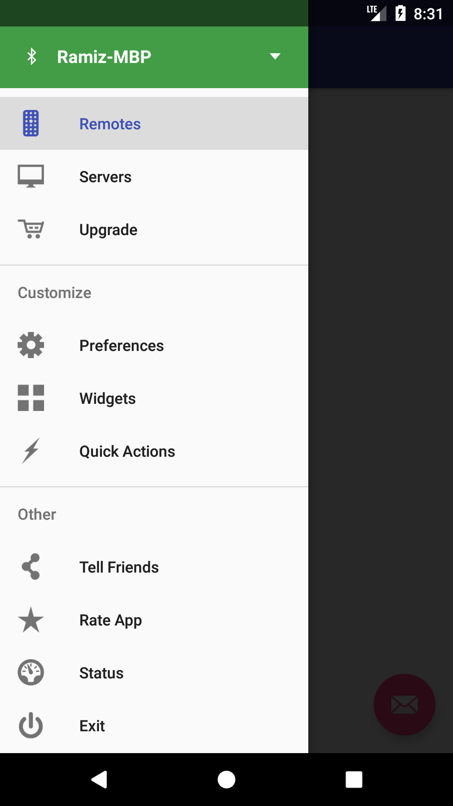

# android-MaterialDesign-NavigationDrawer
Android Material design navigation drawer that can be easily integrated with any existing activities. 



## Motivation
My motivation for working on this project was that I had to work on an app that was using an old nav drawer and I wanted to integration new material design nav drawer without affecting any existing activities.

**Note:** Although this nav drawer can work with fragments as it is pretty general but you should know that I coded this navigation drawer so that it works with existing activities.

## Getting Started

Getting started is really easy, just make the activity that you want to have nav drawer with NavDrawerActivity in this project, override the methods that you are interested in (nav drawer item click, header view click, nav drawer open/close etc.) and you are good to go. Obviously, you have to add your own menu.xml file for nav drawer items.

```
public class YourActivity extends NavDrawerActivity {

}

```

## Files

- **NavDrawerActivity.java** Activity containing all code of nav drawer layout and its related control methods
- **MainActivity.java** Activity to show usage of NavDrawerActivity. It is just a demo activity.
- **NavDrawerHeaderView.java** A custom view coded specifically to be used as header view in nav drawer layout.

## Meta

Ramiz Raja – informramiz@gmail.com

Distributed under the MIT license. See ``LICENSE`` for more information.

[https://github.com/informramiz](https://github.com/informramiz)

## Contributing

1. Fork it (<https://github.com/informramiz/android-MaterialDesign-NavigationDrawer/fork>)
2. Create your feature branch (`git checkout -b feature/fooBar`)
3. Commit your changes (`git commit -am 'Add some fooBar'`)
4. Push to the branch (`git push origin feature/fooBar`)
5. Create a new Pull Request
